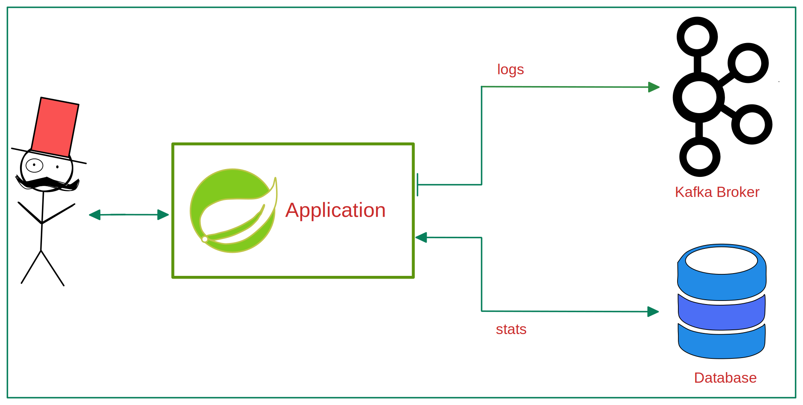

## springboot-webcrawler-example
A simple web crawler built with Spring Boot.

### OverView
- The crawler should be limited to one domain - 
so when you start with https://monzo.com/, it would crawl all pages within monzo.com, 
but not follow external links, for example to the Facebook and Twitter accounts.
(currently, this is an optional feature, as you can decide that per request).  
- Given a URL, it should print a simple site map, showing the links between pages.
Ideally, write it as you would a production piece of code.  
- Bonus points for tests and making it as fast as possible!

- This exercise is not meant to test whether you can program at all, 
but instead, you should think of it as a software design test. 
This means that we care less about a fancy UI or rendering the resulting sitemap
nicely and more about how your program is structured, the trade-offs you've made,
what behaviour the program exhibits etc..
<p align="center">

</p>

### Technologies
- Java 11
- Spring Boot
- Maven
- Kafka ([KafDrop](https://github.com/obsidiandynamics/kafdrop) for Testing)
- Docker

### Notes
- This project uses an embedded "h2 database" locally.
- Provided with spring boot actuator for monitoring & gathering metrics.
- Current configuration is for running this application locally, to configure the application for a different type of environment, you'll need to add/edit some config e.g things related to docker networking. Also, you could utilize spring profiles along with maven profiles to create different configurations based on your needs.


### Testing & Deployment
- First, navigate to this docker-compose [file](https://github.com/ZaTribune/springboot-webcrawler-example/tree/master/src/main/local/docker-compose.yml) and initialize the environment using command:
```
docker-compose up -d
```

- Then, run the application using command:
```
mvn spring-boot:run
```

- To build a Docker image, there's a [DockerFile](https://github.com/ZaTribune/springboot-webcrawler-example/blob/master/DockerFile) provided - navigate and run:
```
mvn clean package
docker build -f DockerFile --tag=zatribune-webcrawler:latest .
```
- To test the application locally, use this endpoint :  

| Method | URL                                            | Body                                                                   |
|--------|------------------------------------------------|------------------------------------------------------------------------|
| POST   | http://localhost:9090/webtools/webcrawler/scan | `{ "url": "https://monzo.com/","breakPoint": 100,"domainOnly": false}` |

- You can open the **KafDrop dashboard** and see Kafka cluster log messages via url:  
  http://localhost:9000/
- Also, You can open the **H2 DB dashboard** via url:  
  http://localhost:9090/webtools/h2-console
## Authors
[](https://linkedin.com/in/zatribune)
